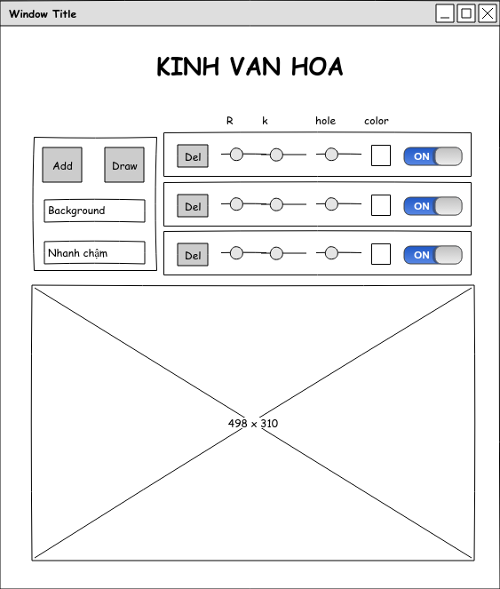

# React App "react-draw-spirograph"

## Giới thiệu

- Tên tiếng Việt: Thước vạn hoa. 
- Mục đích: 
    - Học React
    - Giúp vẽ các spirograph tương tự ở [đây](https://kipalog.com/posts/Ve-Spirograph-bang-D3-js)
- Chức năng:
    - Thêm, xóa, ẩn spirograph
    - Thay đổi các thông số của từng graph
        - R
        - k
        - offset hole
        - màu sắc
    - Thay đổi thông số chung:
        - Màu nền
        - Thời gian:
            - nhanh
            - chậm
    - Download ảnh xuống máy
- Trình duyệt hỗ trợ: Chrome

## Phác thảo giao diện



- Ô số 1 (bên trái)
    - Nút "Add" để thêm Spirograph
    - Nút "Draw" để vẽ
    - Ô "Background" là picker để chọn màu nền
    - Ô "Nhanh chậm" là toggle để chuyển chế độ vẽ Nhanh/ Chậm (Mặc định)
- Ô số 2 (bên phải):
    - Dòng đầu text trên cùng: Ứng với R, k, offset hole, và color
    - Các component bên dưới chứa:
        - Nút "Del" để xóa 
        - Picker dạng scale chọn R, k, offset hole
        - Color picker chọn màu của sipograph
        - Toggle ON/OFF để ẩn/ hiện sipograph.
- Ô to nhất dưới cùng: Chứa ảnh SVG

Ghi chú: 
- Giai đoạn 1: Chỉ cần vẽ 01 Sipograph
- Giai đoạn 2: Có chức năng thêm Sipograph. Số Sipograph tối đa là: 03

## Phân tích bản phác thảo dưới góc nhìn React

### Danh sách Component

- Component `App`: Chứa toàn bộ các component con
- Component `Control`: chứa
    - component `MainControl` (ứng với ô số 1): có button Add, Draw, Color Picker và Toggle button.
    - component `ConfigControl` (ứng với ô số 2): có button Del, Scale Picker (x3), Color Picker và Toggle Button.
- Component `Drawing`

```js
    App
    |
    |------Control
    |       |
    |       |-----MainControl
    |       |
    |       |-----ConfigControl
    |
    |------Drawing
```

### Data Model

```js
[
    {Radius: 100, ratio: 0.7, offsetHole: 20, color: "green", isDisplayed: true},
    {Radius: 100, ratio: 0.7, offsetHole: 20, color: "white", isDisplayed: true},
    {Radius: 100, ratio: 0.7, offsetHole: 20, color: "yellow", isDisplayed: true}
]
```

trong đó:
- Radius: là giá trị của R
- ratio: là giá trị của k
- offsetHole
- color
- isDisplayed: ứng với toggle button ON/OFF

